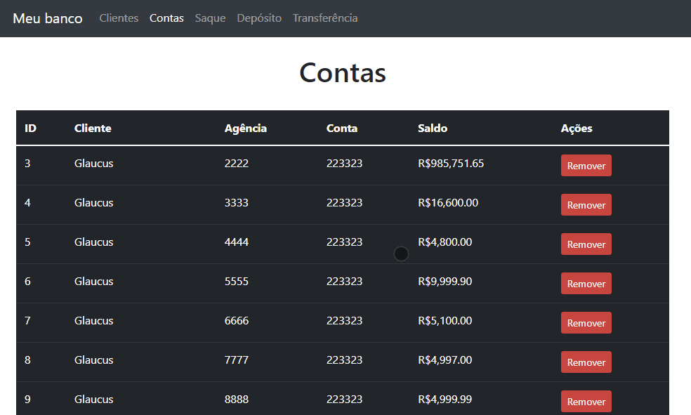
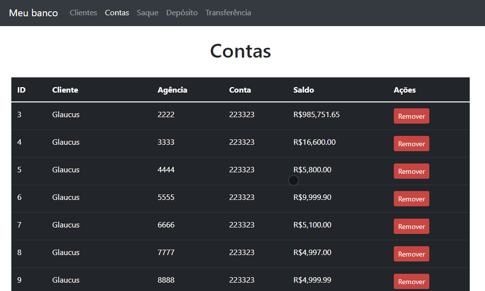
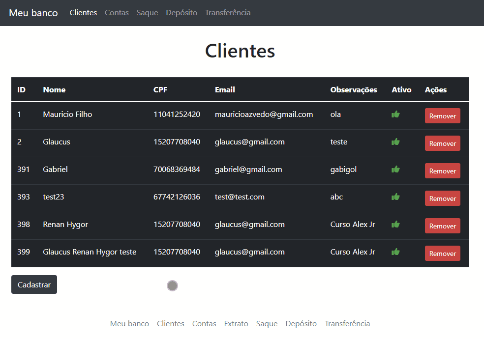
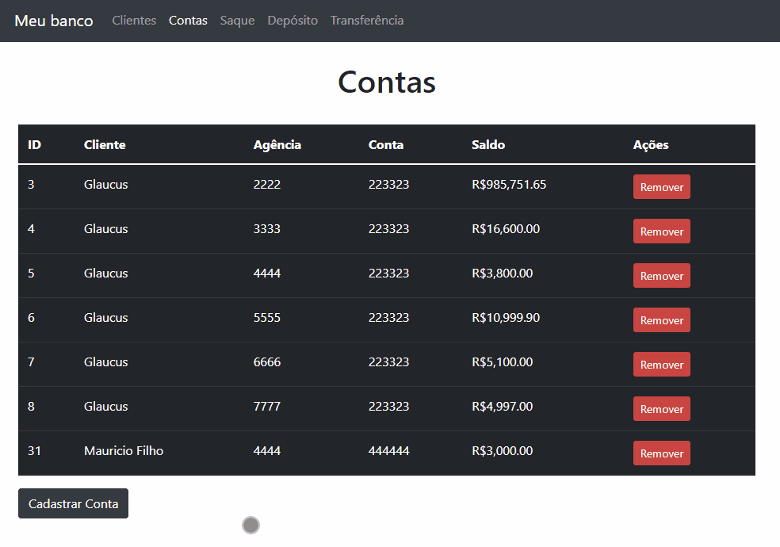

<p align="center"> 💻 Atualizado em 09 de Dezembro de 2021 💻</p>

<h1 align="center"> :man_technologist: MyBank :man_technologist:</h1>

<p align="center">
  

  

  <a href="https://github.com/gabrielcoelhox/course-angular-java/commits/main">
    
  </a>
</p>

[Projeto](#id1)&nbsp;&nbsp;&nbsp;|&nbsp;&nbsp;&nbsp;
[Como executar o projeto](#id2)&nbsp;&nbsp;&nbsp;|&nbsp;&nbsp;&nbsp; 
[Demonstração](#id3)

## <a id="id1"> 💻 Projeto </a>

Este projeto foi desenvolvido como exercício e avaliação do curso de *__Formação Java e Angular - Uniesp__*. A proposta do projeto é criar um sistema de um banco fictício, onde possa ser realizado o CRUD(Criar, ler, atualizar e deletar) das informações obtidas por meio de uma API fornecida pelo professor.

## <a id="id2">:hammer_and_wrench: Como executar o projeto

### Pré-requisitos

Antes de começar, você vai precisar ter instalado em sua máquina as seguintes ferramentas:
- [Git](https://git-scm.com);
- [Node.js][nodejs];
- [VSCode][vscode] (para trabalhar mais facilmente com o código)

<details>
<summary><strong>Rodando a aplicação web (Front End)</strong></summary>

```bash
# Clone este repositório
$ git clone https://github.com/gabrielcoelhox/bytebank.git
# Instale as dependências
$ npm install
# cd view/meubancoangular
$ Inicie a aplicação
# ng s
$ A aplicação será aberta na porta:4200 - acesse http://localhost:4200
```
</details>

<details>
<summary><strong>Rodando API (swagger)</strong></summary>

```bash
$ Execute o arquivo treinamento-spring-boot.war com o terminal
# No terminal use o comando: java -jar treinamento-spring-boot.war
$ A aplicação será aberta na porta:8080 - acesse http://localhost:8080
```
</details>

## <a id="id3"> 🖼️ Demonstração </a>

### Depósito

 
### Saque


### Transferência

  
### Cadastro de Cliente

  
### Cadastro de Conta

 
[nodejs]: https://nodejs.org/
[angular]: https://angular.io/
[vscode]: https://code.visualstudio.com/
[vceditconfig]: https://marketplace.visualstudio.com/items?itemName=EditorConfig.EditorConfig
[license]: https://opensource.org/licenses/MIT
[vceslint]: https://marketplace.visualstudio.com/items?itemName=dbaeumer.vscode-eslint
